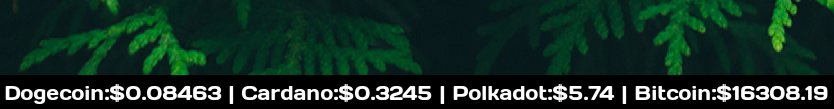

# I3CMC



## Tokenless price parser from coinmarketcap.com for i3blocks.

### Futures:
1. Self-Installer
2. Saving data in cache
3. The possibility of parsing any coin* from the site
4. Something else :)

### Installation:
1. Get the copy if this repository 
```
git clone https://github.com/grndot/i3cmc.git
```
(or download ```.zip``` file below)

2. Make execuable `install.sh`
```
chmod +x install.sh
```
3. Run `install.sh`

4. Fill string* with the name of cryptocurrencies*

5. And fill string with the path to i3's config file

6. ???

7. PROFIT!!!!

#### *

* You will see the name of the coin/token as written.

* Some names of coins and tokens differ from those provided by the site search (for example: [DAI](https://coinmarketcap.com/currencies/multi-collateral-dai/)), use the postfix name from the site address (you can replace dashes to space and use lower- or uppercase).
